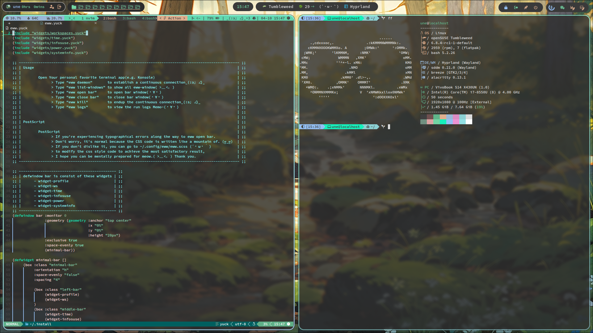

# A simple Hyprland wm environment.

## 1. Screenshot



## 2. List of tools
List of tools
- OS: [openSuSE Tumbleweed](https://get.opensuse.org/tumbleweed/)
- WM: [Hyprland](https://hyprland.org/) - [README](./hypr/doc/README.pdf)
- TopBar: [Eww](https://github.com/elkowar/eww) - [README](./eww/doc/README.pdf)
- Launcher: [Wofi](https://sr.ht/~scoopta/wofi/) - [README](./wofi/doc/README.pdf)
- Terminal: [Konsole](https://konsole.kde.org/) or [Alacritty](https://alacritty.org/) - [README](./alacritty/doc/README.pdf)
- Shell: [Bash](https://www.gnu.org/software/bash/)
- Tmux: [Tmux](https://github.com/tmux/tmux) - [README](./tmux/doc/README.pdf)
- Editor: [Neovim](https://neovim.io/) - [README](./nvim/doc/README.pdf)
- Font: [SauceCodeProCompleteMono](https://github.com/ryanoasis/nerd-fonts)

## 3. Prerequisite

### (1) Install [NF-Font](https://github.com/ryanoasis/nerd-fonts) with [fontpatcher](https://github.com/ryanoasis/nerd-fonts#option-8-patch-your-own-font)

Why do I need it?

> Well, This is to solve the problem that a part of the font called `Glyphs` is displayed incorrectly on some terminal application.

What should I do?

- Download [this nerdfont patcher font](https://github.com/ryanoasis/nerd-fonts/tree/master/patched-fonts/SourceCodePro) provided by [the nerdfont authors](https://github.com/ryanoasis).

- Download [this nerdfont patcher binary](https://github.com/ryanoasis/nerd-fonts#option-8-patch-your-own-font) provided by [the nerdfont authors](https://github.com/ryanoasis).

- Patcher usage(Take the `openSuSE Linux Tumbleweed` system as an example)

    ```bash
    # install [fontforge] via zypper
    # S  | Name            | Summary                                               | Type
    # ---+-----------------+-------------------------------------------------------+---------
    # i+ | fontforge       | A Font Editor                                         | Package
    zypper in fontforge

    # Unzip your fontpatcher and put the font you want to tapped into the fontpatcher
    # Confirm the command provided by the fontpatcher's README.md
    ./fontforge --script ./font-patcher --complete <YOUR FONT FILE>

    # OK, sit and relax to wait for it to be completed.
    # Well, Unsurprisingly, you may see a patched font there.
    # Ok, That is the Complete Font with the Glyphs patch according to your system usage environment

    # OK, Install it in your system environment. _(:з」∠)_
    ``` 

## 4. Suggestion

### (1) Nvidia Graphics Driver - [SDB:NVIDIA drivers](https://en.opensuse.org/SDB:NVIDIA_drivers)

If you're using `openSuSE Tumbleweed` as much as myself, Congratulations! we can check out how to install NVIDIA Driver on `openSuSE Tumbleweed` in this suggestion. 

I'm guessing it's openSuSE Tumbleweed that they maintain themselves, but that's just my guess, and I don't know how it actually is. :(

The reason for this is that I personally think **it's NVIDIA driver can further save RAM usage after installing it.(However, according to feedback, it is also more likely to increase the chances of KernelPanic on some distributions such as archlinux)**

As the same system and the same environment only occupy about 810M memory on my desktop computer that only had nvidia graphics cards 4 years ago.

And on my low-performance laptop that I bought 6 years ago, it takes up 1.28GiB RAM Usage before typing the driver package and about 1.1GiB RAM Usage after installing that nvidia driver.

I personally guess that maybe this is useful, so I recommend installing this here. 

**Although there is also feedback that nvidia driver has a high chance of KernelPanic under the archlinux on Wayland desktop system**, I personally have not found it for the time being. 

Anyway, it's just my personal experience. If you have a graphics card other than an NVIDIA graphics card, this advice is also negligible. :3

### (2) Colorscheme Table

If you're really interested in the color schemes that I use personally, here are all the color schemes I've used or am using.

Colorscheme Table
| nums | HEX | Description
| ---- | ---- | ----
| 1  | `#73ba25` | openSuSE Tumbleweed Green 100%
| 2  | `#81c13b` | openSuSE Tumbleweed Green 90% 	
| 3  | `#96cb5c` | openSuSE Tumbleweed Green 75% 	
| 4  | `#b9dc92` | openSuSE Tumbleweed Green 50% 	
| 5  | `#dceec8` | openSuSE Tumbleweed Green 25% 	
| 6  | `#60B48A` | lualine.normal_mode
| 7  | `#2e8b57` | lualine.insert_mode
| 8  | `#75D701` | lualine.visual_mode
| 9  | `#60B48A` | lualine.terminal_mode
| 10 | `#60B48A` | lualine.command_mode
| 11 | `#ffffff` | everforest.fg     
| 12 | `#ffffff` | everforest.bg0    
| 13 | `#003f3f` | everforest.bg1    
| 14 | `#002b2b` | everforest.bg3    
| 15 | `#2e8b57` | everforest.aqua   
| 16 | `#ff8036` | everforest.orange 
| 17 | `#4e4e4e` | everforest.purple 
| 18 | `#e20000` | everforest.red    
| 19 | `#2aa198` | everforest.grey1  
| 20 | `#3a3a3a` | polybar.background 
| 21 | `#C5C8C6` | polybar.foreground 
| 22 | `#60B48A` | polybar.primary    
| 23 | `#8ABEB7` | polybar.secondary  
| 24 | `#A54242` | polybar.alert      
| 25 | `#707880` | polybar.disabled   
| 26 | `#254742` | polybar.grey       
| 27 | `#2C2C2C` | terminal.primary.background  
| 28 | `#DCDCDC` | terminal.primary.foreground 
| 29 | `#3F3F3F` | terminal.normal.black       
| 30 | `#705050` | terminal.normal.red         
| 31 | `#60B48A` | terminal.normal.green       
| 32 | `#DFAF8F` | terminal.normal.yellow      
| 33 | `#9AB8D7` | terminal.normal.blue
| 34 | `#DC8CC3` | terminal.normal.magenta     
| 35 | `#8CD0D3` | terminal.normal.cyan        
| 36 | `#DCDCDC` | terminal.normal.white       
| 37 | `#709080` | terminal.bright.black       
| 38 | `#DCA3A3` | terminal.bright.red         
| 39 | `#72D5A3` | terminal.bright.green       
| 40 | `#16F0BB` | terminal.bright.yellow      
| 41 | `#94BFF3` | terminal.bright.blue
| 42 | `#EC93D3` | terminal.bright.magenta     
| 43 | `#93E0E3` | terminal.bright.cyan        
| 44 | `#FFFFFF` | terminal.bright.white       
| 45 | `#33ccff` | Hyprland.col.active_border.default.blue
| 46 | `#00ff99` | Hyprland.col.active_border.default.green

## 5. Credit
Credit
- [Hyprland Wiki](https://wiki.hyprland.org/)
- [Archwiki](https://wiki.archlinux.org/)
- [gh0stzk](https://github.com/gh0stzk/dotfiles)
- [lauroro](https://github.com/lauroro/hyprland-dotfiles)

## 6. PostScript
PostScript
- This is my first repository submission on github, and I hope you could understand properly if there is anything unfriendly to you. I'm sorry.

Happy Use！\__(:з」∠)_\_

